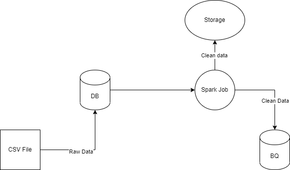

# dummy-project-de

The project's goal is to help ass. data engineer to get familiar with data engineer basic tools.

you have table salary with columns

```csv
work_year,experience_level,employment_type,job_title,salary,salary_currency,salary_in_usd,employee_residence,remote_ratio,company_location,company_size
```

I want you to clean that table into

```csv
work_year,experience_level,employment_type,job_title,salary_in_idr,salary_in_usd,employee_residence,company_location (Name),company_size, created_date
```

This is the data workflow that I you need to follow
